<picture>
  <source media="(prefers-color-scheme: dark)" srcset="assets/ascii-dark.gif">
  
</picture>

<p align="center">
<a href="https://linkedin.com/in/yassin-awad-87b67a332/"></a>
<a href="https://x.com/yassin_awa28231"></a>

</p>

### `~ my stack`

**Languages & Frameworks**

<p>
<a href="https://react.dev"></a>
<a href="https://www.python.org"></a>
<a href="https://javascript.info/intro#what-is-javascript"></a>
<a href="https://www.java.com/en/download/help/whatis_java.html"></a>
<a href="https://tailwindcss.com"></a>
<a href="https://fastapi.tiangolo.com"></a>
<a href="https://www.mongodb.com"></a>
<a href="https://www.mysql.com"></a>
</p>

**Tools & Platforms**

<p>
<a href="https://www.notion.so"></a>
<a href="https://n8n.io"></a>
<a href="https://www.hubspot.com"></a>
<a href="https://www.docker.com"></a>
<a href="https://vercel.com"></a>
<a href="https://github.com/Yassin2626"></a>
</p>


### `~ mcp servers`

<p>
<a href="https://github.com/microsoft/playwright-mcp"></a>
<a href="https://github.com/crystaldba/postgres-mcp"></a>
<a href="https://github.com/docker/mcp-registry"></a>
<a href="https://github.com/github/github-mcp-server"></a>
<a href="https://github.com/modelcontextprotocol/servers/tree/main/src/fetch"></a>
<a href="https://github.com/modelcontextprotocol/servers/tree/main/src/filesystem"></a>
</p>

### `~ about me`

```
Name           ░░░░░░░░░░  Yassen
Surname        ░░░░░░░░░░  Awad
Role           ░░░░░░░░░░  Full Stack Developer
Currently      ░░░░░░░░░░  Building Websites for businesses and currently scaling it
Random facts   ░░░░░░░░░░  16, New York, Volleyball Player, and a robotics hobbyist
```


### `~ by the numbers`

```
Volleyball Tournaments Won      ░░░░░░░░░░    10
Events Hosted & Attended        ░░░░░░░░░░    17
hackathons attended             ░░░░░░░░░░    7
hackathons wins                 ░░░░░░░░░░    2
```


### `~ a day in my life`

```mermaid
%%{init: {'theme':'base','themeVariables':{
  'taskBkgColor':'#39FF14',
  'taskBorderColor':'#39FF14',
  'taskTextColor':'#0d1117',
  'taskTextLightColor':'#0d1117',
  'taskTextDarkColor':'#0d1117',
  'taskTextOutsideColor':'#39FF14',
  'critBkgColor':'#FF00FF',
  'critBorderColor':'#FF00FF',
  'textColor':'#39FF14',
  'titleColor':'#FF00FF',
  'sectionBkgColor':'transparent',
  'altSectionBkgColor':'transparent',
  'gridColor':'#39FF14',
  'tickColor':'#39FF14',
  'todayLineColor':'#FF00FF'
}}}%%
gantt
  dateFormat HH:mm
  axisFormat %H:%M

  section Morning
    High School                  :08:00, 420m

  section Lunch
    Eating Lunch            :crit, 15:00, 35m

  section Afternoon
    Programming & Creating new projects              :16:00, 240m
    Studying for my College Classes & AP's                :20:00, 180m
```



